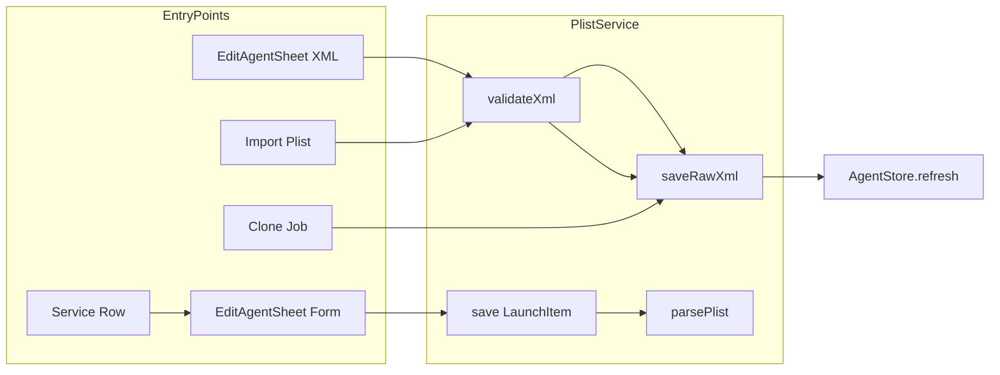

# Design: Plist 工作流增强 — XML 编辑、导入、克隆、Services 预填

**日期:** 2026-07-04  
**状态:** 已批准  
**范围:** v1 — 双模式编辑器 + 导入 + 克隆 + Services → Launch Agent 预填

## 背景

LaunchManager 已有表单式 `EditAgentSheet` 与 `PlistService`（`parsePlist` / `toDictionary` / `save`）。`LaunchItem` 仅覆盖 launchd plist 的子集，不支持 `WorkingDirectory`、`EnvironmentVariables` 等键。

用户日常仍需要终端完成：

- `plutil -p` / 手动编辑 XML
- `cp` plist 到 `~/Library/LaunchAgents`
- 复制现有 job 并改 Label
- 从正在运行的 dev server 反推 launchd 配置

本设计在**克制**原则下，用四个互补功能替代上述终端流程，全部与「launch / launchd」直接相关。

## 目标

| 功能 | v1 |
|------|-----|
| 查看 / 编辑 plist XML | ✅ 双模式 Sheet |
| 从 XML 粘贴新建 Job | ✅ |
| 导入外部 `.plist` 文件 | ✅ |
| 克隆已有 Job | ✅ |
| Services → 预填 Launch Agent | ✅ 仅本地实例 |
| XML 语法高亮 / diff | ❌ |
| Launch Doctor / 模板库 | ❌ |
| Docker → LaunchAgent | ❌ |
| 批量 load/unload | ❌ |

## 方案选择

| 决策 | 选择 | 理由 |
|------|------|------|
| XML 编辑 UX | **A. 双模式 Sheet**（表单 \| XML 分段控件） | 单入口、与现有表单共存；独立 XML 编辑器增加导航成本 |
| 表单不支持的 plist 键 | XML 模式完整保留；表单仅编辑子集 | 避免扩大 `LaunchItem` 到全量 launchd schema |
| `WorkingDirectory` | v1 加入 `LaunchItem` + 表单字段 | Services 预填必需；仅此一个额外键，克制扩展 |
| 克隆后行为 | 不自动 bootstrap | 避免意外双开同名进程 |
| Services 预填范围 | `runtimeGroup == .instance` 且 `killAllowed == true` | 排除 Docker、宿主机制、不可 kill 项 |
| 导入冲突 | 同名 Label 提示覆盖 / 取消 | 与 save 行为一致 |

## 架构

### 模块变更概览

```
LaunchManager/
├── Models/
│   └── LaunchItem.swift          # + workingDirectory: String?
├── Services/
│   └── PlistService.swift        # + readXml, validateXml, saveRawXml, clonePlist
├── Store/
│   └── AgentStore.swift          # + importPlist, cloneItem
├── Views/
│   ├── EditAgentSheet.swift      # Form | XML 分段；从 XML 粘贴入口
│   ├── AgentListView.swift       # 导入 toolbar；新建 ▾ 增加「从 XML 粘贴」
│   ├── AgentRowView.swift        # 复制… 菜单项
│   ├── CloneAgentSheet.swift     # 新 Label + scope 选择（新建）
│   ├── ImportPlistSheet.swift    # scope 选择 + 冲突处理（新建，或 inline alert）
│   └── ServiceRowView.swift      # 「创建 Launch Agent…」按钮
└── Utilities/
    └── CommandLineParser.swift   # 将 service.command 拆为 ProgramArguments（新建）
```

### PlistService 扩展

**新增类型**

```swift
enum PlistValidationError: Error, Equatable {
    case invalidFormat(String)
    case missingLabel
    case duplicateLabel(existingURL: URL)
}
```

**新增方法**

| 方法 | 职责 |
|------|------|
| `readXml(from url: URL) throws -> String` | 读文件并转为 XML 字符串（已是 XML 则原样；binary 则转换） |
| `validateXml(_ string: String) -> Result<[String: Any], PlistValidationError>` | `PropertyListSerialization` + 必须有 `Label` |
| `saveRawXml(_ string: String, to url: URL, scope: Scope, privilege: PrivilegeService) throws` | 校验后写入；系统 scope 走特权 `mv` + `chown` |
| `clonePlist(from sourceURL: URL, newLabel: String, targetScope: Scope) throws -> URL` | 读 dict → 改 `Label` → 写入 `{scope}/{newLabel}.plist` |

**`parsePlist` / `toDictionary` 变更**

- 读写 `WorkingDirectory` 字符串键（可选）
- `saveRawXml` 不经过 `LaunchItem`，保证 XML 中额外键不被 strip

**表单 ↔ XML 同步规则**

1. **表单 → XML**：用 `toDictionary(item)` 生成 XML；若磁盘上该 plist 含表单未建模的键，首次切到 XML 时从磁盘 `readXml` 读取（不丢失额外键）。
2. **XML → 表单**：`validateXml` 成功后尝试 `parsePlist`；若失败（例如仅有 `Program` 而无 `ProgramArguments` 且结构特殊），禁用表单 tab 并显示说明：「当前 plist 含表单无法完整表示的内容，请使用 XML 模式编辑。」
3. **保存**：表单模式走现有 `save(_:privilege:)`；XML 模式走 `saveRawXml`。

### EditAgentSheet 双模式

**UI**

- 顶部 `Picker`：`表单` | `XML`（`segmented`）
- XML 区：`TextEditor` + monospaced 字体；底部校验错误（红色 caption）
- 新建时 toolbar **从剪贴板粘贴** 按钮（可选，与 AgentListView 入口二选一或两处皆有）

**状态**

- `@State private var editorMode: EditorMode = .form`
- `@State private var xmlText: String`
- `@State private var xmlValidationError: String?`

**保存逻辑**

```
if editorMode == .form {
    build LaunchItem from @State fields → store.save
} else {
    validateXml(xmlText) → saveRawXml to computed plistURL → store.refresh
}
```

**新建 Job 的 plist 路径**

- `{scope.directoryURL}/{label}.plist`（与现有一致）
- Label 变更时 XML 模式下同步更新 `Label` 键（保存前）或提示用户手动改

### 导入 Plist

**入口**：`AgentListView` toolbar **导入…**（`square.and.arrow.down`）

**流程**

1. `NSOpenPanel`：仅 `.plist`，单选
2. `validateXml` 读文件内容
3. 从 dict 取 `Label`；目标路径 `{selectedScope}/{Label}.plist`
4. 若文件已存在 → `NSAlert`：覆盖 / 取消
5. 用户选 scope（sheet 或 popover：用户 Agent / 全局 Agent / LaunchDaemon）
6. `saveRawXml` 或文件 copy（外部文件 → 目标目录；内容不变）
7. `AgentStore.refresh()`
8. 可选 alert：「是否立即载入？」→ 调用现有 `launchctl bootstrap` 流程

**特权**：`systemAgent` / `systemDaemon` 走 `PrivilegeService`。

### 克隆 Job

**入口**：`AgentRowView` 展开操作区或 context menu → **复制…**

**UI**：`CloneAgentSheet`

- 新 Label（默认 `{原Label}.copy`，可编辑）
- 目标 scope（默认与原 Job 相同）
- 校验：目标路径不存在或用户确认覆盖

**实现**

```swift
PlistService.clonePlist(from: item.plistURL, newLabel: newLabel, targetScope: scope)
→ AgentStore.refresh()
→ toast: 「已创建 {newLabel}，未自动载入」
```

不修改原 plist；不 bootout 原 job。

### Services → 创建 Launch Agent

**入口**：`ServiceRowView` 展开区按钮 **创建 Launch Agent…**

**显示条件**

```swift
service.runtimeGroup == .instance && service.killAllowed
```

**预填映射**

| LaunchItem 字段 | 来源 |
|-----------------|------|
| `label` | 建议 `dev.{port}.{slug}`，slug 来自 `displayName` 小写 alphanumeric；用户可改 |
| `program` + `programArguments` | `CommandLineParser.parse(service.command)`；失败则 `program = service.executable` |
| `workingDirectory` | `service.workingDirectory ?? service.processDirectory` |
| `runAtLoad` | `true` |
| `keepAlive` | `false` |
| `triggerType` | `.atLoad` |
| `scope` | `.userAgent`（defaultScope） |

**流程**

1. 点击按钮 → `EditAgentSheet(existingItem: nil, defaultScope: .userAgent, prefilled: LaunchAgentDraft(...))`
2. 用户确认 Label、触发方式、KeepAlive 等 → 保存
3. 不自动 bootstrap

**CommandLineParser**

- 简单 shell 分词：尊重单引号 / 双引号
- 单元测试覆盖：带空格路径、`npm run dev`、仅 executable fallback

### AgentStore 扩展

| 方法 | 职责 |
|------|------|
| `importPlist(from url: URL, scope: Scope, overwrite: Bool) throws` | 封装导入流程 |
| `cloneItem(_ item: LaunchItem, newLabel: String, scope: Scope) throws` | 封装克隆 + refresh |

## 数据流



## 错误处理

| 场景 | 行为 |
|------|------|
| 非法 XML / 非 plist | XML 编辑器内联错误，Save 禁用 |
| 缺 Label | 校验错误，不写入 |
| 导入重名 | Alert 覆盖 / 取消 |
| 克隆 Label 冲突 | Sheet 内联错误 |
| 特权写入失败 | 现有 `PrivilegeService` 错误 toast |
| 表单 ↔ XML 不可转换 | 禁用表单 tab + 说明文案 |
| Service command 无法解析 | fallback 到 executable，workingDirectory 仍预填 |

## 本地化

新增字符串（zh-Hans + en）：

- 分段控件：表单 / XML
- 导入、复制、从 XML 粘贴、创建 Launch Agent
- 校验错误、覆盖确认、克隆成功 toast
- WorkingDirectory 表单标签

## 测试

| 区域 | 用例 |
|------|------|
| `PlistService` | validateXml：合法 / 缺 Label / 畸形 XML；saveRawXml 保留额外键；readXml binary→xml |
| `LaunchItem` | WorkingDirectory 往返 parse/toDictionary |
| `CommandLineParser` | 引号路径、npm 脚本、空 command |
| `AgentStore` | clone 新路径；import 冲突 |
| UI（可选） | EditAgentSheet 模式切换 snapshot |

## 明确不做（YAGNI）

- Launch Doctor、复制 `launchctl` 命令到剪贴板
- plist 模板库、批量操作
- Docker 容器 → LaunchAgent
- XML 语法高亮、行号、diff 视图
- `EnvironmentVariables` 表单字段（v1 仅 XML 模式保留）

## 与 CHANGELOG 关系

实现完成后在 `[Unreleased]` 增加：

- Plist XML 查看/编辑与从 XML 粘贴新建
- 导入 plist 文件
- 克隆 Launch Job
- Services 一键预填 Launch Agent（含 WorkingDirectory 表单支持）
